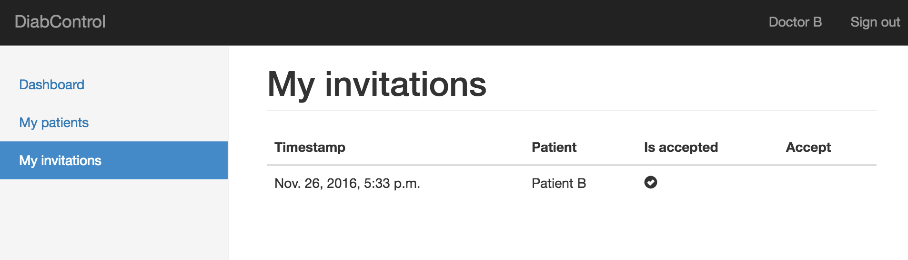
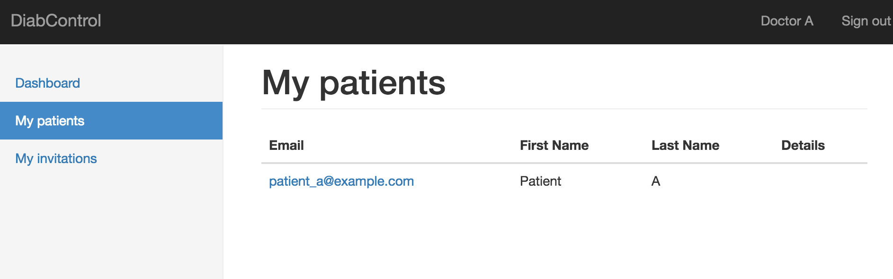
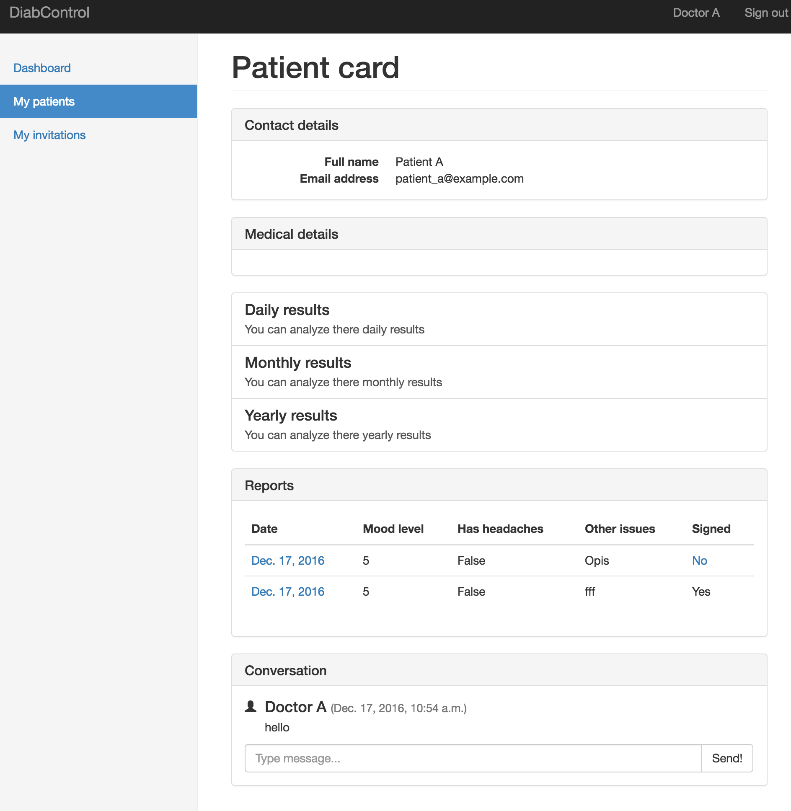
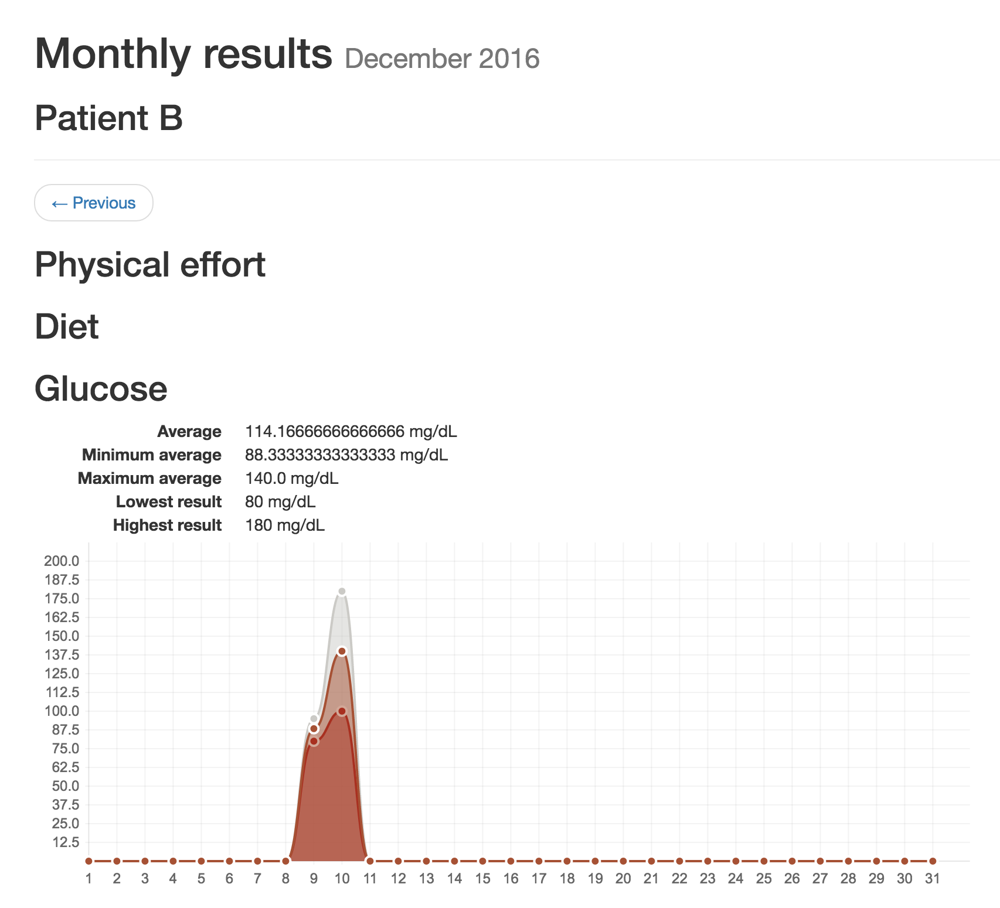

Doktor
======

Lista pacjentów
---------------

Aby mieć dostep do danych pacjenta oraz możliwości komunikacji z nim musi on w pierwszej kolejności wysłać zaproszenie.
Jeżeli zaproszenie zostanie przyjęte, to automatycznie jako lekarz otrzymasz dostęp do danych historycznych pacjenta - 
wszystkie dane które zgromadził w serwisie.

Lista Twoich aktywnych pacjentów jest dostępna w zakładce "My patients". Zawiera ona podstawowe dane o każdym z pacjentów.

Karta pacjenta
--------------

Karta pacjenta, to strona główna informacji o danej osobie.

Na tej stronie znajdują się:
* Podstawowe informacje kontaktowe
* Ogólny opis choroby / osoby
* Dane gromadzone przez użytkownika
* Raporty
* Centrum komunikacji z użytkownikiem

Raporty użytkownika
-------------------

Każdy użytkownik pod koniec dnia powinien wysłać raport dzienny.
Na tej podstawie można monitorować przebieh choroby i wcześniej reagować na pogarszające się wyniki zdrowia.

Weryfikacja raportu
-------------------

Aby raport mógł być dostępny na zewnątrz, musi zostać zweryfikowana przez jendego z lekarzy prowadzących.
Ma to na celu uniknąć sytuacji w której użytkownik wprowadzi błędne dane lub w przypadku awarii urządzenia monitorującego 
lub błędu pomiaru.

Każdy raport jest weryfikowany przy pomocy podpisu cyfrowego lekarza.
