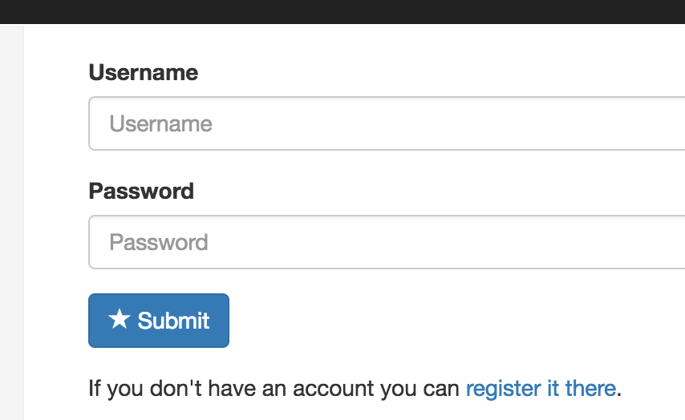
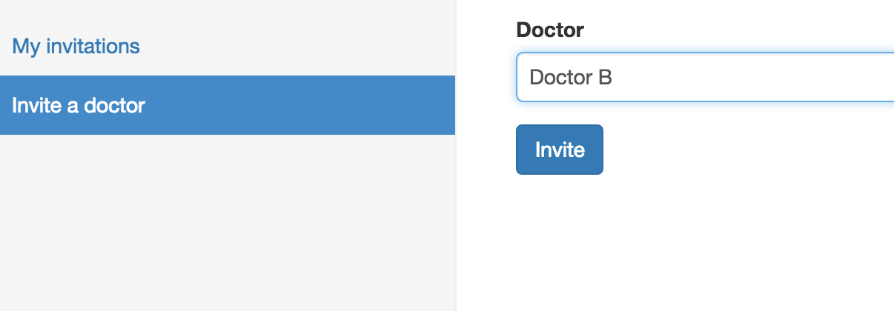
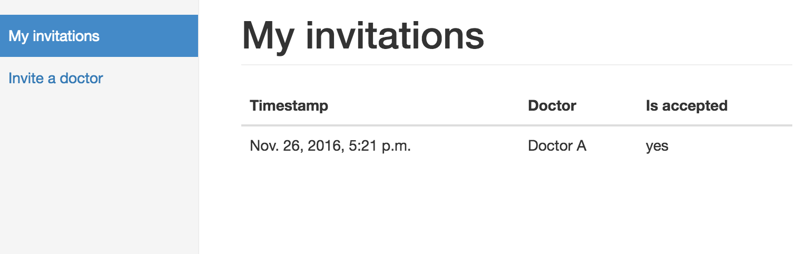

Pacjent
==========

Strona głowna
-------------

Strona domowa umożliwia utwrzenie konta lub logowanie.
Sposób logowania / rejestracji jest podobny jak w większości aplikacji internetowych.

Adres email, to jednocześnie twoja nazwa użytkownika

Lekarz prowadzący
-----------------

Domyślnie Twoje wyniki są gromadzone w serwisie i są dostępne tylko dla Ciebie.
Aby stan Twojego zdrowia był dodatkowo monitorowany przez lekarza, musisz mu udostępnić swoje dane uzyskane z pomiarów
i dostęp do swoich raportów dziennych.

Pamiętaj: lekarz może odrzucić Twoją proźbę o monitorowanie stanu zdrowia np. w sytuacji kiedy ma zbyt dużo pacjentów.

Jednocześnie możesz korzystać z porad wielu lekarzy. Wszyscy oni mają dostęp do Twoich wyników i raportów dziennych.

W każdej chwili możesz sprawdzić który lekarz ma dostęp do Twoich danych

Pamiętaj: jeżeli lekarz ma status "Is accepted: No", to nie ma dostępu do Twoich danych.